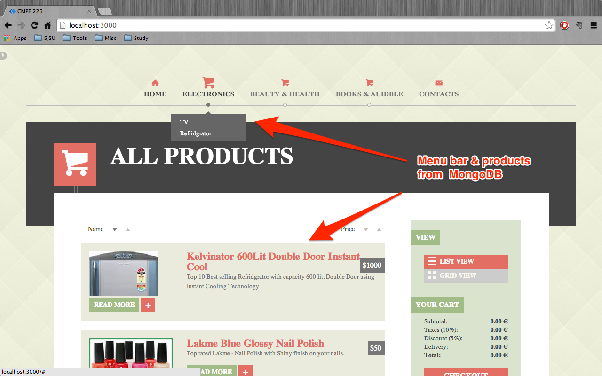
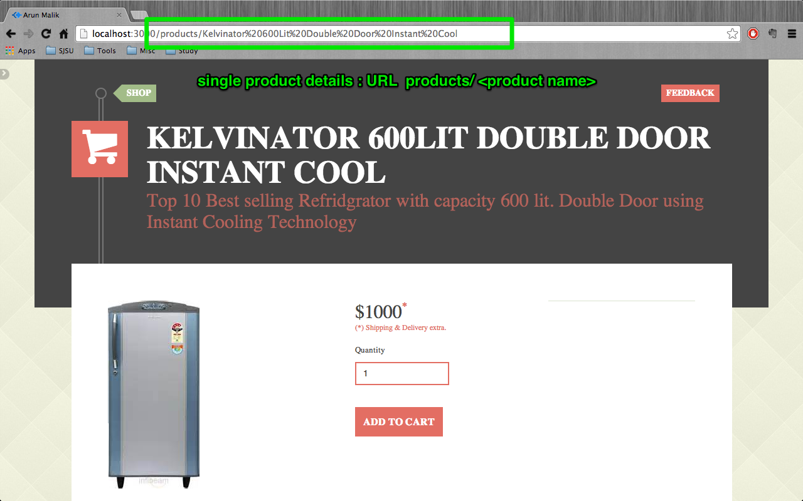
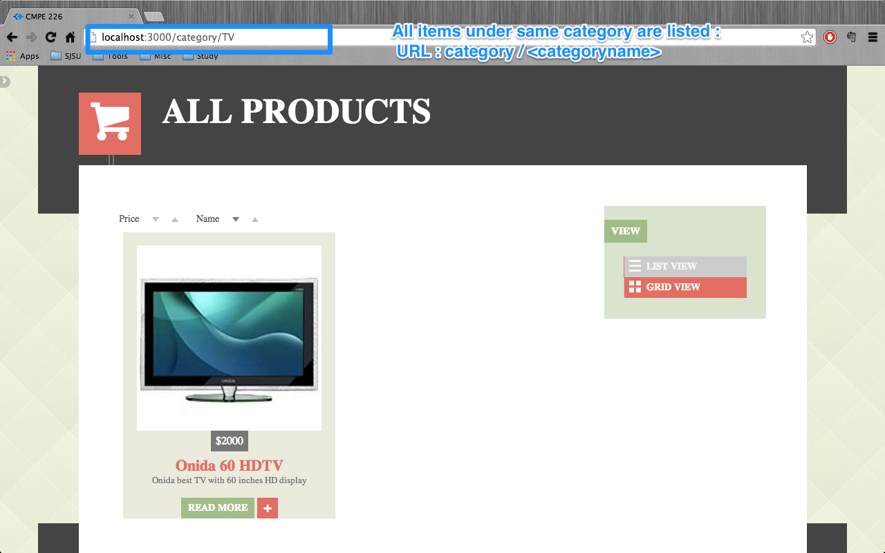
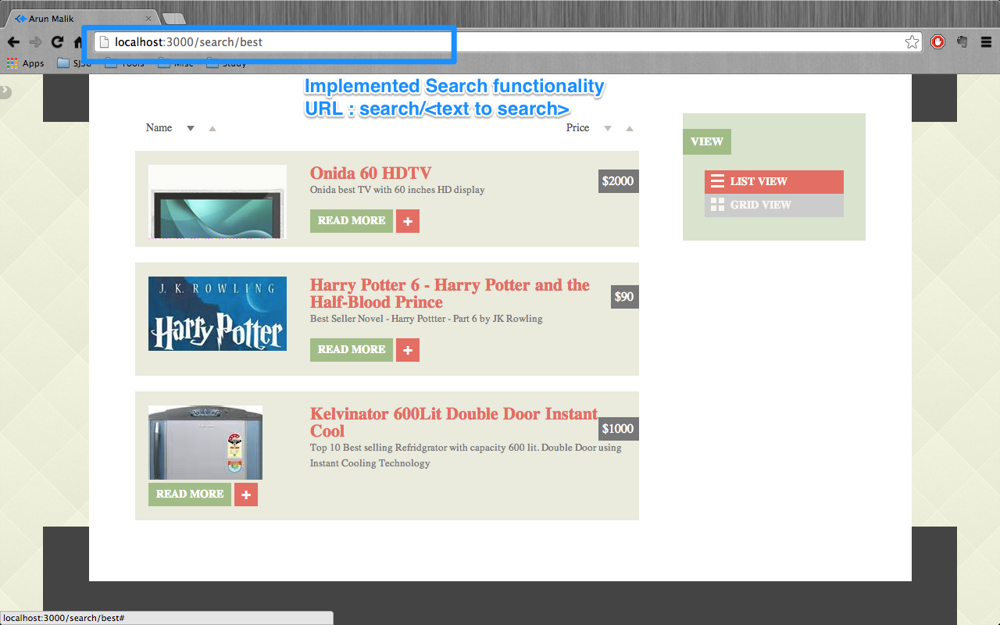

cmpe226Project-eCommerceWebsite
===============================

This is a assignment given in class CMPE 226 ( Database Systems ) to develop a eCommerce Website using NodeJs and MongoDB

ScreenShots
=============

